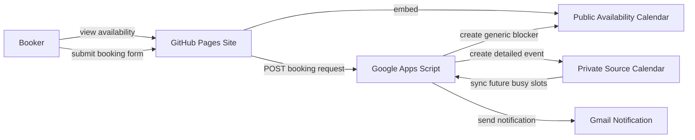

# Gig Booking

Minimal gig booking site for GitHub Pages with Google Calendar for availability and Google Apps Script for event creation.

## Problem statement

Gig offers usually arrive through SMS, WhatsApp, Messenger, Instagram, or email. The problem is not getting the first enquiry. The problem is the repeated back and forth after that:

- are you free on this date?
- where is it?
- what is the rate?
- what gear is provided?
- what time is load in?

This project gives you one link to send to bookers so they can check availability and submit the core details in one pass. That removes the slow message loop and pencils the date into your calendar immediately without exposing private event details on the public calendar.

## What this solves

- Gives bookers a single booking link instead of a fragmented message thread.
- Uses a public Google Calendar as a derived availability layer.
- Lets the booker submit the key details in one form.
- Creates a detailed private event and a privacy-safe public blocker automatically.
- Sends you an email notification for each accepted submission.
- Keeps the whole setup simple, lightweight, and free for normal personal use.

## What the site does

1. The booker opens the page.
2. They check the embedded Google Calendar.
3. They submit:
   - music type
   - date
   - start time
   - end time
   - location
   - rate
   - gear provided
   - load in
   - optional contact
   - optional notes
4. Google Apps Script creates a detailed event in the private source calendar.
5. Google Apps Script creates or updates a generic timed blocker in the public availability calendar.
6. You receive an email notification with the submitted details.

If the bandleader or organiser wants to own the final invite, they can still create and send a separate Google Calendar invite later. The private calendar remains the source of truth. The public calendar is only an availability layer.

## Architecture

This uses the simplest free architecture that still allows calendar writes while keeping the public calendar privacy-safe.

### Frontend

- GitHub Pages
- plain HTML, CSS, and JavaScript
- embedded public Google Calendar
- form submission directly to Google Apps Script

### Backend

- Google Apps Script web app
- CalendarApp for private event creation and public blocker sync
- MailApp for notification emails
- basic anti-bot checks before event creation
- time-driven or manual sync from private calendar to public calendar

### Why this split exists

GitHub Pages is static hosting only. It can serve the website, but it cannot securely create Google Calendar events by itself. Google Apps Script is the minimal Google-native backend that can receive the form submission, write to a private source calendar, mirror privacy-safe blockers to a public calendar, and send an email.

## Free architecture summary

- Website hosting: GitHub Pages
- Availability display: public Google Calendar embed
- Event creation: Google Apps Script web app
- Source of truth: private Google Calendar
- Public blocker sync: Google Apps Script
- Email notification: Google Apps Script via MailApp
- Running cost: effectively free within normal GitHub Pages and Google account quotas

## Repository structure

- `index.html`
  Main booking page markup.
- `styles.css`
  Minimal CLI-style monochrome visual design and responsive layout.
- `app.js`
  Frontend configuration, calendar wiring, form handling, and UI feedback.
- `google-apps-script/Code.gs`
  Google Apps Script backend that creates private events, syncs public blockers, sends the email, and applies anti-bot rules.

## Deploying the website with GitHub Pages

1. Push this repository to GitHub.
2. Open the repository settings.
3. Go to `Pages`.
4. Set the source to deploy from the main branch.
5. Use the repository root as the publish directory.
6. Save the settings and wait for the Pages build to finish.

Because the frontend is static, there is no build step required.

## Google Apps Script setup

1. Open Google Apps Script.
2. Create a standalone project.
3. Paste in `google-apps-script/Code.gs`.
4. Save the script.
5. Open `Project Settings` and add these Script Properties:
   - `PRIVATE_CALENDAR_ID`
   - `PUBLIC_CALENDAR_ID`
   - `EVENT_TITLE_PREFIX`
   - `PUBLIC_EVENT_TITLE`
   - `NOTIFICATION_EMAIL`
   - `DEFAULT_LOOKAHEAD_DAYS`
   - `MIN_SUBMIT_SECONDS`
   - `COOLDOWN_SECONDS`
   - `SYNC_LOOKAHEAD_DAYS`
   - `SYNC_PAST_DAYS`
6. Recommended values:
   - `EVENT_TITLE_PREFIX=Music`
   - `PUBLIC_EVENT_TITLE=Booked / On Hold`
   - `DEFAULT_LOOKAHEAD_DAYS=90`
   - `MIN_SUBMIT_SECONDS=4`
   - `COOLDOWN_SECONDS=600`
   - `SYNC_LOOKAHEAD_DAYS=180`
   - `SYNC_PAST_DAYS=2`
7. Deploy the project as a web app:
   - Execute as: `Me`
   - Who has access: `Anyone`
8. Copy the deployed `/exec` URL.
9. Paste that URL into `app.js` as `appsScriptWebAppUrl`.
10. Add a time-driven trigger for `syncAvailability` if you want the public calendar to stay current with external invites accepted into the private calendar.
11. Redeploy the Apps Script whenever the backend code changes.

Important note:

- `NOTIFICATION_EMAIL` should not live in the repo
- the private and public calendar IDs should not live in the repo backend code
- the anti-bot and availability settings are now also driven by Script Properties, so the backend can be tuned without committing personal configuration
- the public availability calendar may still be inferable from the frontend because this project intentionally uses a public Google Calendar embed on a static site
- public calendar events should stay generic and privacy-safe because that calendar is treated as an availability layer, not the full source of truth

## Apps Script configuration

The backend now reads all runtime configuration from Apps Script `Script Properties`.

- `PRIVATE_CALENDAR_ID`
  The private source calendar that holds the real detailed events.
- `PUBLIC_CALENDAR_ID`
  The public availability calendar that holds generic blockers only.
- `EVENT_TITLE_PREFIX`
  Prefix used in private events and private email notifications, for example `Music`.
- `PUBLIC_EVENT_TITLE`
  Generic title used for public calendar blockers, for example `Booked / On Hold`.
- `NOTIFICATION_EMAIL`
  Address that receives booking notifications.
- `DEFAULT_LOOKAHEAD_DAYS`
  Number of future days used when fetching availability.
- `MIN_SUBMIT_SECONDS`
  Minimum time a user must spend on the form before the submission is accepted.
- `COOLDOWN_SECONDS`
  Cache-based duplicate cooldown window.
- `SYNC_LOOKAHEAD_DAYS`
  Number of future days to mirror from the private calendar into the public calendar.
- `SYNC_PAST_DAYS`
  Number of past days to keep included in sync cleanup.

## Frontend configuration

Update `app.js` if you want to change:

- page title
- intro copy
- calendar embed URL
- public calendar link
- Apps Script endpoint
- music type dropdown values
- footer playlist and social links

## Anti-bot protections

The current backend includes a simple baseline protection layer:

- hidden honeypot field
- minimum time-on-form check using `startedAt`
- submission fingerprinting
- cooldown and duplicate blocking

This is intentionally lightweight. It is enough to reduce low-effort spam and repeated accidental submissions without adding visible friction for real users.

Important caveat:

- duplicate protection is currently strict
- identical submissions may be rejected after the first accepted request

That is good for reducing spam, but it can also block a legitimate retry if someone submits the exact same details again.

## Limitations

- The availability view is still the native Google Calendar embed.
- Browser date pickers are partially browser-controlled, so full styling is limited.
- Backend changes require a new Apps Script deployment version.
- Anti-bot protection is intentionally simple, not enterprise-grade.
- This is still a lightweight calendar workflow, not a full booking CRM or approval system.

## Why this is useful

This project is deliberately narrow. It does not try to replace your calendar, your messaging apps, or your booking workflow. It solves one specific problem well:

- a booker can see if a date looks free
- they can send the key details once
- the detailed event lands in the private calendar immediately
- the public calendar stays generic and privacy-safe

That is enough to reduce admin overhead and avoid double booking without paying for a booking platform or maintaining a custom backend.
